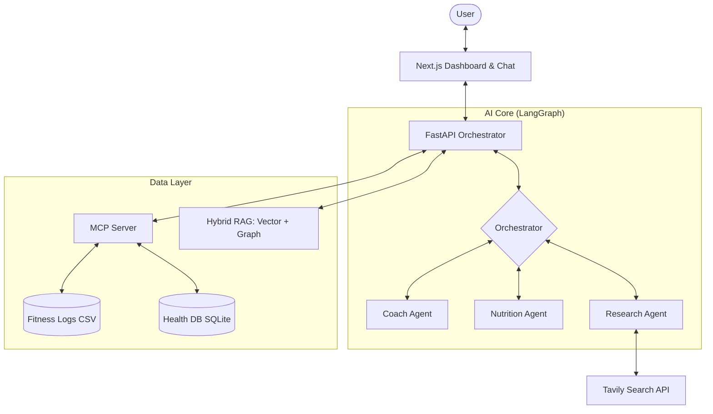

# 🏋️ AI Fitness Pal: Your Personal Health Architect

[](https://nextjs.org/)
[](https://fastapi.tiangolo.com/)
[](https://github.com/langchain-ai/langgraph)
[](https://modelcontextprotocol.io/)

AI Fitness Pal is a state-of-the-art personal health and fitness ecosystem. It leverages multi-agent orchestration, **Model Context Protocol (MCP)** for secure local data access, and **Hybrid RAG** (Vector + Knowledge Graph) to provide deeply personalized coaching, nutrition analysis, and real-time health insights.

---

## 🏗️ Architecture

The system is built on a modular, agentic architecture designed for privacy and intelligence:



1.  **Frontend (Next.js 15)**: A premium, responsive interface featuring dynamic charts, streaming chat, and file upload capabilities.
2.  **Backend (FastAPI)**: The brain of the system, using **LangGraph** to coordinate specialized agents (Coach, Nutrition, Researcher) through complex reasoning loops.
3.  **MCP Server (Python)**: Implements the Model Context Protocol to bridge AI agents with local files (CSV workout logs, SQLite health databases) without compromising data privacy.

---

## ✨ Key Features

-   **🤖 Multi-Agent Orchestration**: Specialized agents collaborate to solve complex queries. The Coach handles training, while the Nutrition agent analyzes diet—all coordinated by a central orchestrator.
-   **🔍 Live Research Integration**: Powered by Tavily, the system performs real-time research on the latest fitness studies and supplement efficacy to ensure advice is science-backed.
-   **🧠 Hybrid RAG Strategy**: Combines **Vector Search** for semantic retrieval with a **Knowledge Graph** for complex relationship mapping (e.g., how specific exercises impact recovery).
-   **🎙️ Interactive Morning Briefing**: A personalized audio summary generated via OpenAI TTS, recapping your previous day's performance and outlining today's goals.
-   **📊 Dynamic Dashboard**: Real-time visualization of weight progress, PRs, and recovery scores fetched directly from your local data via MCP.
-   **📄 Multimodal Vision**: Upload meal photos for calorie estimation or medical PDFs for summarized health insights.

---

## 🚀 Getting Started

### Prerequisites

-   **Python**: 3.10 or higher
-   **Node.js**: 18 or higher (LTS recommended)
-   **API Keys**: OpenAI API Key, Tavily API Key (optional for research)

### 1. MCP Server Setup
The MCP server must be running to provide data to the backend.
```bash
cd fitness_mcp
python -m venv .venv
source .venv/bin/activate
pip install -r requirements.txt # If available, or install mcp
python server.py
```

### 2. Backend Setup
```bash
cd backend
python -m venv .venv
source .venv/bin/activate
pip install -r requirements.txt
# Create a .env file with:
# OPENAI_API_KEY=your_key_here
# TAVILY_API_KEY=your_key_here
python main.py
```

### 3. Frontend Setup
```bash
cd frontend
npm install
npm run dev
```

The application will be available at [http://localhost:3000](http://localhost:3000).

---

## 🛠️ Tech Stack

-   **Frontend**: Next.js 15, TypeScript, Tailwind CSS, Shadcn/UI, Lucide React, Framer Motion.
-   **Backend**: FastAPI, LangChain, LangGraph, Pydantic, OpenAI GPT-4o.
-   **Data Protocol**: Model Context Protocol (MCP).
-   **Search**: Tavily Search API.
-   **Storage**: Local CSV, SQLite, and ChromaDB (for vector RAG).


