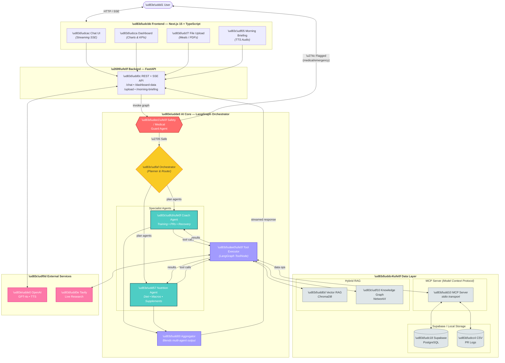

# 🏋️ AI Fitness Pal: Your Personal Health Architect

[](https://nextjs.org/)
[](https://fastapi.tiangolo.com/)
[](https://github.com/langchain-ai/langgraph)
[](https://modelcontextprotocol.io/)

AI Fitness Pal is a state-of-the-art personal health and fitness ecosystem. It leverages multi-agent orchestration, **Model Context Protocol (MCP)** for secure local data access, and **Hybrid RAG** (Vector + Knowledge Graph) to provide deeply personalized coaching, nutrition analysis, and real-time health insights.

---

## 🏗️ Architecture

The system is built on a modular, agentic architecture designed for privacy, safety, and intelligence:


```mermaid
flowchart TB
    %% ── External ──────────────────────────────────────────────
    User(["\ud83e\uddd1 User"])

    subgraph Frontend ["<b>\ud83d\udcbb Frontend  &mdash;  Next.js 15 + TypeScript</b>"]
        direction LR
        Chat["\ud83d\udcac Chat UI<br/><i>(Streaming SSE)</i>"]
        Dashboard["\ud83d\udcca Dashboard<br/><i>(Charts & KPIs)</i>"]
        Upload["\ud83d\udcf7 File Upload<br/><i>(Meals / PDFs)</i>"]
        Briefing["\ud83c\udf05 Morning Briefing<br/><i>(TTS Audio)</i>"]
    end

    subgraph Backend ["<b>\u2699\ufe0f Backend  &mdash;  FastAPI</b>"]
        direction TB
        API["\ud83d\udd0c REST + SSE API<br/>/chat &bull; /dashboard-data<br/>/upload &bull; /morning-briefing"]
    end

    subgraph LangGraph ["<b>\ud83e\udde0 AI Core  &mdash;  LangGraph Orchestrator</b>"]
        direction TB

        SafetyGuard{{"\ud83d\udee1\ufe0f Safety / Medical<br/>Guard Agent"}}

        Orchestrator{"\ud83c\udfaf Orchestrator<br/><i>(Planner & Router)</i>"}

        subgraph Specialists ["Specialist Agents"]
            direction LR
            Coach["\ud83c\udfcb\ufe0f Coach Agent<br/><i>Training &bull; PRs &bull; Recovery</i>"]
            Nutrition["\ud83e\udd57 Nutrition Agent<br/><i>Diet &bull; Macros &bull; Supplements</i>"]
        end

        ToolNode["\ud83d\udee0\ufe0f Tool Executor<br/><i>(LangGraph ToolNode)</i>"]
        Aggregator["\ud83d\udd00 Aggregator<br/><i>Blends multi-agent output</i>"]
    end

    subgraph DataLayer ["<b>\ud83d\uddc4\ufe0f Data Layer</b>"]
        direction TB

        subgraph MCP ["MCP Server  <i>(Model Context Protocol)</i>"]
            direction LR
            MCPServer["\ud83d\udd10 MCP Server<br/><i>stdio transport</i>"]
        end

        subgraph Storage ["Supabase / Local Storage"]
            direction LR
            Supabase[("\ud83d\udc18 Supabase<br/>PostgreSQL")]
            CSV[("\ud83d\udcc4 CSV<br/>PR Logs")]
        end

        subgraph RAG ["Hybrid RAG"]
            direction LR
            VectorRAG["\ud83d\udd0d Vector RAG<br/><i>ChromaDB</i>"]
            GraphRAG["\ud83c\udf10 Knowledge Graph<br/><i>NetworkX</i>"]
        end
    end

    subgraph External ["<b>\ud83c\udf0d External Services</b>"]
        direction LR
        OpenAI["\ud83e\udde0 OpenAI<br/>GPT-4o &bull; TTS"]
        Tavily["\ud83d\udd0e Tavily<br/>Live Research"]
    end

    %% ── Connections ────────────────────────────────────────────
    User <-->|"HTTP / SSE"| Frontend
    Chat --> API
    Dashboard --> API
    Upload --> API
    Briefing --> API

    API -->|"invoke graph"| SafetyGuard

    SafetyGuard -->|"\u274c Flagged<br/>(medical/emergency)"| User
    SafetyGuard -->|"\u2705 Safe"| Orchestrator

    Orchestrator -->|"plan agents"| Coach
    Orchestrator -->|"plan agents"| Nutrition

    Coach -->|"tool calls"| ToolNode
    Nutrition -->|"tool calls"| ToolNode
    ToolNode -->|"results"| Coach
    ToolNode -->|"results"| Nutrition

    Coach --> Aggregator
    Nutrition --> Aggregator
    Aggregator -->|"streamed response"| API

    ToolNode <-->|"data ops"| MCPServer
    MCPServer <--> Supabase
    MCPServer <--> CSV
    ToolNode <--> VectorRAG
    ToolNode <--> GraphRAG
    ToolNode <--> Tavily
    API <--> OpenAI

    %% ── Styles ─────────────────────────────────────────────────
    classDef guard fill:#ff6b6b,stroke:#c0392b,color:#fff,stroke-width:2px
    classDef agent fill:#4ecdc4,stroke:#1a535c,color:#fff,stroke-width:2px
    classDef orch fill:#f9ca24,stroke:#f0932b,color:#333,stroke-width:2px
    classDef tool fill:#a29bfe,stroke:#6c5ce7,color:#fff,stroke-width:2px
    classDef data fill:#dfe6e9,stroke:#636e72,color:#2d3436,stroke-width:1px
    classDef ext fill:#fd79a8,stroke:#e84393,color:#fff,stroke-width:2px

    class SafetyGuard guard
    class Coach,Nutrition agent
    class Orchestrator orch
    class ToolNode,Aggregator tool
    class MCPServer,Supabase,CSV,VectorRAG,GraphRAG data
    class OpenAI,Tavily ext
```

### System Flow

1. **User → Frontend (Next.js 15)**: Premium, responsive interface with streaming chat (SSE), dynamic charts, file uploads, and TTS-powered morning briefings.
2. **Frontend → FastAPI Backend**: REST endpoints handle chat, dashboard data, file uploads, and audio generation.
3. **FastAPI → Safety Guard** *(new)*: Every incoming message is first screened by the **Safety/Medical Guard Agent**. It uses a two-tier detection strategy (fast regex scan + LLM confirmation) to intercept medical, emergency, or mental-health queries and return compassionate disclaimers with professional resources.
4. **Safety Guard → Orchestrator**: Safe messages are routed to the **LangGraph Orchestrator**, which plans which specialist agents (Coach, Nutrition, or both) should respond.
5. **Orchestrator → Specialist Agents**: The **Coach Agent** handles training, PRs, and recovery. The **Nutrition Agent** handles diet, macros, and supplements. Both can invoke tools.
6. **Agents ↔ Tool Executor**: Agents call tools for calculations (1RM, TDEE), data access (MCP → Supabase), knowledge retrieval (Hybrid RAG), live research (Tavily), and visualization.
7. **Aggregator → User**: When multiple agents contribute, the **Aggregator** blends their outputs into a single cohesive response streamed back to the user.

---

## ✨ Key Features

-   **🤖 Multi-Agent Orchestration**: Specialized agents collaborate to solve complex queries. The Coach handles training, while the Nutrition agent analyzes diet—all coordinated by a central orchestrator.
-   **🛡️ Safety/Medical Guard**: A pre-routing agent that detects medical emergencies, injury treatment requests, eating disorders, and mental health crises—gracefully declining with professional resources instead of unsafe advice.
-   **🔍 Live Research Integration**: Powered by Tavily, the system performs real-time research on the latest fitness studies and supplement efficacy to ensure advice is science-backed.
-   **🧠 Hybrid RAG Strategy**: Combines **Vector Search** (ChromaDB) for semantic retrieval with a **Knowledge Graph** (NetworkX) for complex relationship mapping (e.g., how specific exercises impact recovery).
-   **🎙️ Interactive Morning Briefing**: A personalized audio summary generated via OpenAI TTS, recapping your previous day's performance and outlining today's goals.
-   **📊 Dynamic Dashboard**: Real-time visualization of weight progress, PRs, and recovery scores fetched directly from Supabase via MCP.
-   **📄 Multimodal Vision**: Upload meal photos for calorie estimation or medical PDFs for summarized health insights.

---

## 🚀 Getting Started

### Prerequisites

-   **Python**: 3.10 or higher
-   **Node.js**: 18 or higher (LTS recommended)
-   **API Keys**: OpenAI API Key, Tavily API Key (optional for research)
-   **Database**: Supabase project (or local SQLite fallback)

### 1. MCP Server Setup
The MCP server must be running to provide data to the backend.
```bash
cd fitness_mcp
python -m venv .venv
source .venv/bin/activate
pip install -r requirements.txt # If available, or install mcp
python server.py
```

### 2. Backend Setup
```bash
cd backend
python -m venv .venv
source .venv/bin/activate
pip install -r requirements.txt
# Create a .env file with:
# OPENAI_API_KEY=your_key_here
# TAVILY_API_KEY=your_key_here
# SUPABASE_URL=your_supabase_url
# SUPABASE_KEY=your_supabase_key
python main.py
```

### 3. Frontend Setup
```bash
cd frontend
npm install
npm run dev
```

The application will be available at [http://localhost:3000](http://localhost:3000).

---

## 🛠️ Tech Stack

-   **Frontend**: Next.js 15, TypeScript, Tailwind CSS, Shadcn/UI, Lucide React, Framer Motion.
-   **Backend**: FastAPI, LangChain, LangGraph, Pydantic, OpenAI GPT-4o.
-   **Data Protocol**: Model Context Protocol (MCP).
-   **Search**: Tavily Search API.
-   **Storage**: Supabase (PostgreSQL), local CSV fallback, ChromaDB (Vector RAG).


