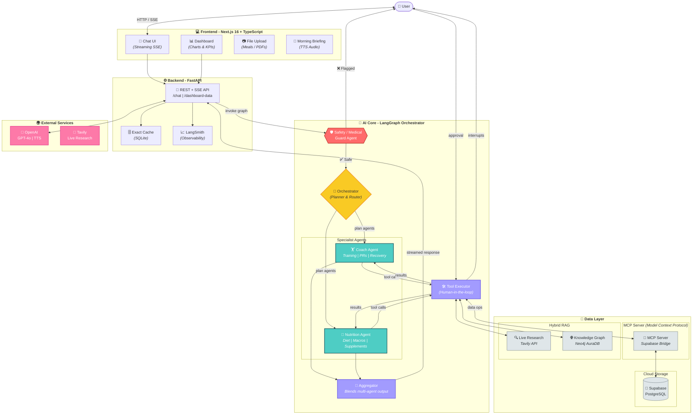

# 🏋️ AI Fitness Pal: Your Personal Health Architect

[](https://nextjs.org/)
[](https://fastapi.tiangolo.com/)
[](https://github.com/langchain-ai/langgraph)
[](https://modelcontextprotocol.io/)
[](https://neo4j.com/)

AI Fitness Pal is a personal health and fitness assistant. It leverages multi-agent orchestration, **Model Context Protocol (MCP)** for secure data access, and **Hybrid RAG** (Knowledge Graph + Live Research) to provide personalized coaching, nutrition analysis, and real-time health insights.

---

## 🏗️ Architecture

The system is built on a modular, agentic architecture designed for privacy, safety, and intelligence:


```mermaid
flowchart TB
    %% ── External ──────────────────────────────────────────────
    User(["🧑 User"])

    subgraph Frontend ["<b>💻 Frontend - Next.js 16 + TypeScript</b>"]
        direction LR
        Chat["💬 Chat UI<br/><i>(Streaming SSE)</i>"]
        Dashboard["📊 Dashboard<br/><i>(Charts & KPIs)</i>"]
        Upload["📷 File Upload<br/><i>(Meals / PDFs)</i>"]
        Briefing["🌅 Morning Briefing<br/><i>(TTS Audio)</i>"]
    end

    subgraph Backend ["<b>⚙️ Backend - FastAPI</b>"]
        direction TB
        API["🔌 REST + SSE API<br/>/chat | /dashboard-data"]
        Cache["🗄️ Exact Cache<br/><i>(SQLite)</i>"]
        Tracing["📈 LangSmith<br/><i>(Observability)</i>"]
    end

    subgraph LangGraph ["<b>🧠 AI Core - LangGraph Orchestrator</b>"]
        direction TB

        SafetyGuard{{"🛡️ Safety / Medical<br/>Guard Agent"}}

        Orchestrator{"🎯 Orchestrator<br/><i>(Planner & Router)</i>"}

        subgraph Specialists ["Specialist Agents"]
            direction LR
            Coach["🏋️ Coach Agent<br/><i>Training | PRs | Recovery</i>"]
            Nutrition["🥗 Nutrition Agent<br/><i>Diet | Macros | Supplements</i>"]
        end

        ToolNode["🛠️ Tool Executor<br/><i>(Human-in-the-loop)</i>"]
        Aggregator["🔀 Aggregator<br/><i>Blends multi-agent output</i>"]
    end

    subgraph DataLayer ["<b>📂 Data Layer</b>"]
        direction TB

        subgraph MCP ["MCP Server  <i>(Model Context Protocol)</i>"]
            direction LR
            MCPServer["🔐 MCP Server<br/><i>Supabase Bridge</i>"]
        end

        subgraph Storage ["Cloud Storage"]
            direction LR
            Supabase[("🐘 Supabase<br/>PostgreSQL")]
        end

        subgraph RAG ["Hybrid RAG"]
            direction LR
            Research["🔍 Live Research<br/><i>Tavily API</i>"]
            GraphRAG["🌐 Knowledge Graph<br/><i>Neo4j AuraDB</i>"]
        end
    end

    subgraph External ["<b>🌍 External Services</b>"]
        direction LR
        OpenAI["🧠 OpenAI<br/>GPT-4o | TTS"]
        Tavily["🔎 Tavily<br/>Live Research"]
    end

    %% ── Connections ────────────────────────────────────────────
    User <-->|"HTTP / SSE"| Chat
    Chat --> API
    Dashboard --> API
    
    API --> Cache
    API --> Tracing
    API -->|"invoke graph"| SafetyGuard

    SafetyGuard -->|"❌ Flagged"| User
    SafetyGuard -->|"✅ Safe"| Orchestrator

    Orchestrator -->|"plan agents"| Coach
    Orchestrator -->|"plan agents"| Nutrition

    Coach -->|"tool calls"| ToolNode
    Nutrition -->|"tool calls"| ToolNode
    ToolNode -->|"interrupts"| User
    User -->|"approval"| ToolNode
    ToolNode -->|"results"| Coach
    ToolNode -->|"results"| Nutrition

    Coach --> Aggregator
    Nutrition --> Aggregator
    Aggregator -->|"streamed response"| API

    ToolNode <-->|"data ops"| MCPServer
    MCPServer <--> Supabase
    ToolNode <--> Research
    ToolNode <--> GraphRAG
    API <--> OpenAI

    %% ── Styles ─────────────────────────────────────────────────
    classDef guard fill:#ff6b6b,stroke:#c0392b,color:#fff,stroke-width:2px
    classDef agent fill:#4ecdc4,stroke:#1a535c,color:#fff,stroke-width:2px
    classDef orch fill:#f9ca24,stroke:#f0932b,color:#333,stroke-width:2px
    classDef tool fill:#a29bfe,stroke:#6c5ce7,color:#fff,stroke-width:2px
    classDef data fill:#dfe6e9,stroke:#636e72,color:#2d3436,stroke-width:1px
    classDef ext fill:#fd79a8,stroke:#e84393,color:#fff,stroke-width:2px

    class SafetyGuard guard
    class Coach,Nutrition agent
    class Orchestrator orch
    class ToolNode,Aggregator tool
    class MCPServer,Supabase,Research,GraphRAG data
    class OpenAI,Tavily ext
```

### System Flow

1.  **User Interaction**: Premium Next.js 16 interface with streaming chat (SSE), dynamic charts, and TTS briefings.
2.  **Safety First**: The **Safety/Medical Guard** screens all inputs to intercept medical emergencies or unsafe requests, providing compassionate redirects.
3.  **Agentic Orchestration**: **LangGraph** coordinates specialized **Coach** and **Nutrition** agents. It uses persistent checkpointers to maintain conversation state.
4.  **Human-in-the-Loop**: Destructive data operations (like deleting logs or significant PR updates) trigger an **interrupt**, requiring explicit user approval before execution.
5.  **Smart Caching & Tracing**: **Fast SQLite Caching** reduces LLM latency and costs for repeated queries. **LangSmith** provides production-grade observability.
6.  **Data Sovereignty (MCP)**: Data access is abstracted through a **Model Context Protocol** server, ensuring secure and standardized communication with the **Supabase** backend.

---

## ✨ Key Features

-   **🤖 Multi-Agent Orchestration**: Specialized agents collaborate to solve complex queries. Coordinated by a central orchestrator via LangGraph.
-   **🛡️ Safety/Medical Guard**: Pre-routing agent that detects medical emergencies and mental health crises—gracefully declining with professional resources.
-   **🔍 Hybrid RAG Strategy**: Combines **Live Internet Research** (Tavily) for the latest trends with a **Neo4j Knowledge Graph** for complex relationship mapping (e.g., supplement interactions).
-   **⚡ Fast Caching**: Powered by SQLite, caching exact LLM responses to minimize latency and API costs for frequent requests.
-   **🕵️ Production Observability**: Integrated with **LangSmith** for deep-dive tracing, debugging, and performance monitoring.
-   **🤝 Human-in-the-Loop**: Safe execution of tools via LangGraph interrupts, ensuring users always have the final say on data-destructive actions.
-   **📊 Dynamic Dashboard**: Real-time visualization of fitness data fetched directly from Supabase via MCP.
-   **🎙️ Morning Briefing**: Personalized audio summary generated via OpenAI TTS, recapping performance and outlining goals.

---

## 🚀 Getting Started

### Prerequisites

-   **Python**: 3.10+
-   **Node.js**: 18+
-   **Databases**: Supabase (PostgreSQL), Neo4j AuraDB (Graph).
-   **API Keys**: OpenAI, Tavily, LangSmith.

### 1. Database & Environment Setup
Create a `.env` file in the `backend` directory with the following:
```env
OPENAI_API_KEY=sk-...
TAVILY_API_KEY=tvly-...
SUPABASE_URL=https://...
SUPABASE_KEY=...
NEO4J_URI=neo4j+s://...
NEO4J_USER=neo4j
NEO4J_PASSWORD=...
LANGCHAIN_TRACING_V2=true
LANGCHAIN_API_KEY=lsv2_...
```

### 2. MCP Server Setup
```bash
cd fitness_mcp
python -m venv .venv && source .venv/bin/activate
pip install -r requirements.txt
python server.py
```

### 3. Backend Setup
```bash
cd backend
python -m venv .venv && source .venv/bin/activate
pip install -r requirements.txt
# (Optional) Seed the Neo4j Graph
python seed_neo4j.py
# Run the server
python main.py
```

### 4. Frontend Setup
```bash
cd frontend
npm install
npm run dev
```

### Local Docker Setup
Make sure these env files exist before starting Docker:

- `backend/.env` for backend, MCP, Supabase, Neo4j, OpenAI, Tavily, LangSmith.
- `frontend/.env` with `NEXT_PUBLIC_API_URL=http://localhost:8000`.

Run the full local stack:

```bash
docker compose up --build
```

The backend Docker image installs `backend/requirements.runtime.txt`, which contains only runtime dependencies. Keep using `backend/requirements.txt` for local development, tests, and evaluation tooling.

Then open:

- Frontend: `http://localhost:3000`
- Backend docs: `http://localhost:8000/docs`

Stop the stack:

```bash
docker compose down
```

---

## 🛠️ Tech Stack

-   **Frontend**: Next.js 16 (App Router), TypeScript, Tailwind CSS, Framer Motion.
-   **AI Framework**: LangChain, LangGraph, LangSmith.
-   **Models**: OpenAI GPT-4o, TTS-1.
-   **Databases**: Supabase (Postgres), Neo4j (Graph).
-   **Protocols**: Model Context Protocol (MCP), SSE (Streaming).
-   **Validation**: Pydantic v2 (Strict Tool Validation).

---

## 🧪 Testing & Evaluation

This project includes a comprehensive testing and evaluation framework to ensure reliability and response quality.

### Unit Tests
Unit tests use `pytest` and `pytest-asyncio`. They test core logic and agent routing using mocks to avoid unnecessary API costs.

To run unit tests:
```bash
cd backend
PYTHONPATH=. pytest tests/
```

### Automated Evaluation (Golden Dataset)
We use **Ragas** to measure the quality of the RAG responses against a "Golden Dataset".

- **Files**: 
  - `backend/tests/eval_dataset.json`: Golden dataset of diverse fitness questions.
  - `backend/tests/run_evals.py`: Evaluation runner script.
- **Metrics**: 
  - **Faithfulness**: Detects hallucinations by verifying answers against retrieved context.
  - **Answer Relevance**: Ensures the response directly addresses the user's query.

#### Running Evaluations
Requires an `OPENAI_API_KEY` for the Ragas evaluator.

```bash
cd backend
PYTHONPATH=. python tests/run_evals.py
```

Results are saved to `backend/tests/eval_results.csv`.
