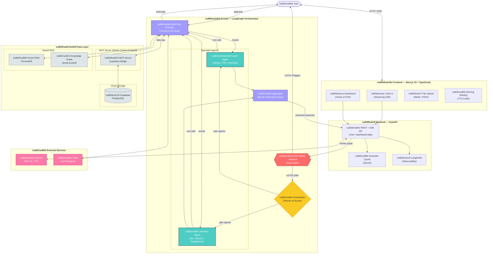

# 🏋️ AI Fitness Pal: Your Personal Health Architect

[](https://nextjs.org/)
[](https://fastapi.tiangolo.com/)
[](https://github.com/langchain-ai/langgraph)
[](https://modelcontextprotocol.io/)
[](https://neo4j.com/)

AI Fitness Pal is a personal health and fitness assistant. It leverages multi-agent orchestration, **Model Context Protocol (MCP)** for secure data access, and **Hybrid RAG** (Vector + Knowledge Graph) to provide personalized coaching, nutrition analysis, and real-time health insights.

---

## 🏗️ Architecture

The system is built on a modular, agentic architecture designed for privacy, safety, and intelligence:


```mermaid
flowchart TB
    %% ── External ──────────────────────────────────────────────
    User(["\ud83e\uddd1 User"])

    subgraph Frontend ["<b>\ud83d\udcbb Frontend  &mdash;  Next.js 15 + TypeScript</b>"]
        direction LR
        Chat["\ud83d\udcac Chat UI<br/><i>(Streaming SSE)</i>"]
        Dashboard["\ud83d\udcca Dashboard<br/><i>(Charts & KPIs)</i>"]
        Upload["\ud83d\udcf7 File Upload<br/><i>(Meals / PDFs)</i>"]
        Briefing["\ud83c\udf05 Morning Briefing<br/><i>(TTS Audio)</i>"]
    end

    subgraph Backend ["<b>\u2699\ufe0f Backend  &mdash;  FastAPI</b>"]
        direction TB
        API["\ud83d\udd0c REST + SSE API<br/>/chat &bull; /dashboard-data"]
        Cache["\ud83c\udfb0 Semantic Cache<br/><i>(SQLite)</i>"]
        Tracing["\ud83d\udcc8 LangSmith<br/><i>(Observability)</i>"]
    end

    subgraph LangGraph ["<b>\ud83e\udde0 AI Core  &mdash;  LangGraph Orchestrator</b>"]
        direction TB

        SafetyGuard{{"\ud83d\udee1\ufe0f Safety / Medical<br/>Guard Agent"}}

        Orchestrator{"\ud83c\udfaf Orchestrator<br/><i>(Planner & Router)</i>"}

        subgraph Specialists ["Specialist Agents"]
            direction LR
            Coach["\ud83c\udfcb\ufe0f Coach Agent<br/><i>Training &bull; PRs &bull; Recovery</i>"]
            Nutrition["\ud83e\udd57 Nutrition Agent<br/><i>Diet &bull; Macros &bull; Supplements</i>"]
        end

        ToolNode["\ud83d\udee0\ufe0f Tool Executor<br/><i>(Human-in-the-loop)</i>"]
        Aggregator["\ud83d\udd00 Aggregator<br/><i>Blends multi-agent output</i>"]
    end

    subgraph DataLayer ["<b>\ud83d\uddc4\ufe0f Data Layer</b>"]
        direction TB

        subgraph MCP ["MCP Server  <i>(Model Context Protocol)</i>"]
            direction LR
            MCPServer["\ud83d\udd10 MCP Server<br/><i>Supabase Bridge</i>"]
        end

        subgraph Storage ["Cloud Storage"]
            direction LR
            Supabase[("\ud83d\udc18 Supabase<br/>PostgreSQL")]
        end

        subgraph RAG ["Hybrid RAG"]
            direction LR
            VectorRAG["\ud83d\udd0d Vector RAG<br/><i>ChromaDB</i>"]
            GraphRAG["\ud83c\udf10 Knowledge Graph<br/><i>Neo4j AuraDB</i>"]
        end
    end

    subgraph External ["<b>\ud83c\udf0d External Services</b>"]
        direction LR
        OpenAI["\ud83e\udde0 OpenAI<br/>GPT-4o &bull; TTS"]
        Tavily["\ud83d\udd0e Tavily<br/>Live Research"]
    end

    %% ── Connections ────────────────────────────────────────────
    User <-->|"HTTP / SSE"| Frontend
    Chat --> API
    Dashboard --> API
    
    API --> Cache
    API --> Tracing
    API -->|"invoke graph"| SafetyGuard

    SafetyGuard -->|"\u274c Flagged"| User
    SafetyGuard -->|"\u2705 Safe"| Orchestrator

    Orchestrator -->|"plan agents"| Coach
    Orchestrator -->|"plan agents"| Nutrition

    Coach -->|"tool calls"| ToolNode
    Nutrition -->|"tool calls"| ToolNode
    ToolNode -->|"interrupts"| User
    User -->|"approval"| ToolNode
    ToolNode -->|"results"| Coach
    ToolNode -->|"results"| Nutrition

    Coach --> Aggregator
    Nutrition --> Aggregator
    Aggregator -->|"streamed response"| API

    ToolNode <-->|"data ops"| MCPServer
    MCPServer <--> Supabase
    ToolNode <--> VectorRAG
    ToolNode <--> GraphRAG
    ToolNode <--> Tavily
    API <--> OpenAI

    %% ── Styles ─────────────────────────────────────────────────
    classDef guard fill:#ff6b6b,stroke:#c0392b,color:#fff,stroke-width:2px
    classDef agent fill:#4ecdc4,stroke:#1a535c,color:#fff,stroke-width:2px
    classDef orch fill:#f9ca24,stroke:#f0932b,color:#333,stroke-width:2px
    classDef tool fill:#a29bfe,stroke:#6c5ce7,color:#fff,stroke-width:2px
    classDef data fill:#dfe6e9,stroke:#636e72,color:#2d3436,stroke-width:1px
    classDef ext fill:#fd79a8,stroke:#e84393,color:#fff,stroke-width:2px

    class SafetyGuard guard
    class Coach,Nutrition agent
    class Orchestrator orch
    class ToolNode,Aggregator tool
    class MCPServer,Supabase,VectorRAG,GraphRAG data
    class OpenAI,Tavily ext
```

### System Flow

1.  **User Interaction**: Premium Next.js 15 interface with streaming chat (SSE), dynamic charts, and TTS briefings.
2.  **Safety First**: The **Safety/Medical Guard** screens all inputs to intercept medical emergencies or unsafe requests, providing compassionate redirects.
3.  **Agentic Orchestration**: **LangGraph** coordinates specialized **Coach** and **Nutrition** agents. It uses persistent checkpointers to maintain conversation state.
4.  **Human-in-the-Loop**: Destructive data operations (like deleting logs or significant PR updates) trigger an **interrupt**, requiring explicit user approval before execution.
5.  **Smart Caching & Tracing**: **Semantic Caching** reduces LLM latency and costs, while **LangSmith** provides production-grade observability.
6.  **Data Sovereignty (MCP)**: Data access is abstracted through a **Model Context Protocol** server, ensuring secure and standardized communication with the **Supabase** backend.

---

## ✨ Key Features

-   **🤖 Multi-Agent Orchestration**: Specialized agents collaborate to solve complex queries. Coordinated by a central orchestrator via LangGraph.
-   **🛡️ Safety/Medical Guard**: Pre-routing agent that detects medical emergencies and mental health crises—gracefully declining with professional resources.
-   **🔍 Hybrid RAG Strategy**: Combines **Vector Search** (ChromaDB) for semantic retrieval with a **Neo4j Knowledge Graph** for complex relationship mapping (e.g., supplement interactions).
-   **⚡ Semantic Caching**: Powered by SQLite, caching LLM responses based on semantic similarity to minimize latency and API costs.
-   **🕵️ Production Observability**: Integrated with **LangSmith** for deep-dive tracing, debugging, and performance monitoring.
-   **🤝 Human-in-the-Loop**: Safe execution of tools via LangGraph interrupts, ensuring users always have the final say on data-destructive actions.
-   **📊 Dynamic Dashboard**: Real-time visualization of fitness data fetched directly from Supabase via MCP.
-   **🎙️ Morning Briefing**: Personalized audio summary generated via OpenAI TTS, recapping performance and outlining goals.

---

## 🚀 Getting Started

### Prerequisites

-   **Python**: 3.10+
-   **Node.js**: 18+
-   **Databases**: Supabase (PostgreSQL), Neo4j AuraDB (Graph), ChromaDB (Local Vector).
-   **API Keys**: OpenAI, Tavily, LangSmith.

### 1. Database & Environment Setup
Create a `.env` file in the `backend` directory with the following:
```env
OPENAI_API_KEY=sk-...
TAVILY_API_KEY=tvly-...
SUPABASE_URL=https://...
SUPABASE_KEY=...
NEO4J_URI=neo4j+s://...
NEO4J_USER=neo4j
NEO4J_PASSWORD=...
LANGCHAIN_TRACING_V2=true
LANGCHAIN_API_KEY=lsv2_...
```

### 2. MCP Server Setup
```bash
cd fitness_mcp
python -m venv .venv && source .venv/bin/activate
pip install -r requirements.txt
python server.py
```

### 3. Backend Setup
```bash
cd backend
python -m venv .venv && source .venv/bin/activate
pip install -r requirements.txt
# (Optional) Seed the Neo4j Graph
python seed_neo4j.py
# Run the server
python main.py
```

### 4. Frontend Setup
```bash
cd frontend
npm install
npm run dev
```

---

## 🛠️ Tech Stack

-   **Frontend**: Next.js 15 (App Router), TypeScript, Tailwind CSS, Framer Motion.
-   **AI Framework**: LangChain, LangGraph, LangSmith.
-   **Models**: OpenAI GPT-4o, TTS-1.
-   **Databases**: Supabase (Postgres), Neo4j (Graph), ChromaDB (Vector).
-   **Protocols**: Model Context Protocol (MCP), SSE (Streaming).
-   **Validation**: Pydantic v2 (Strict Tool Validation).


